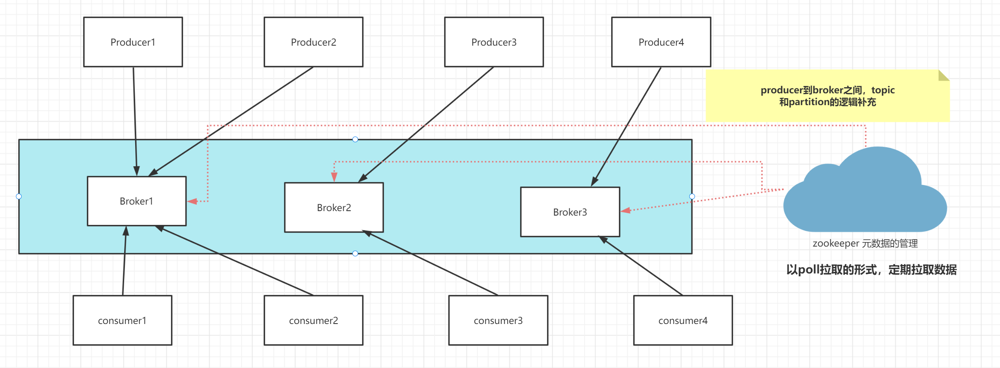
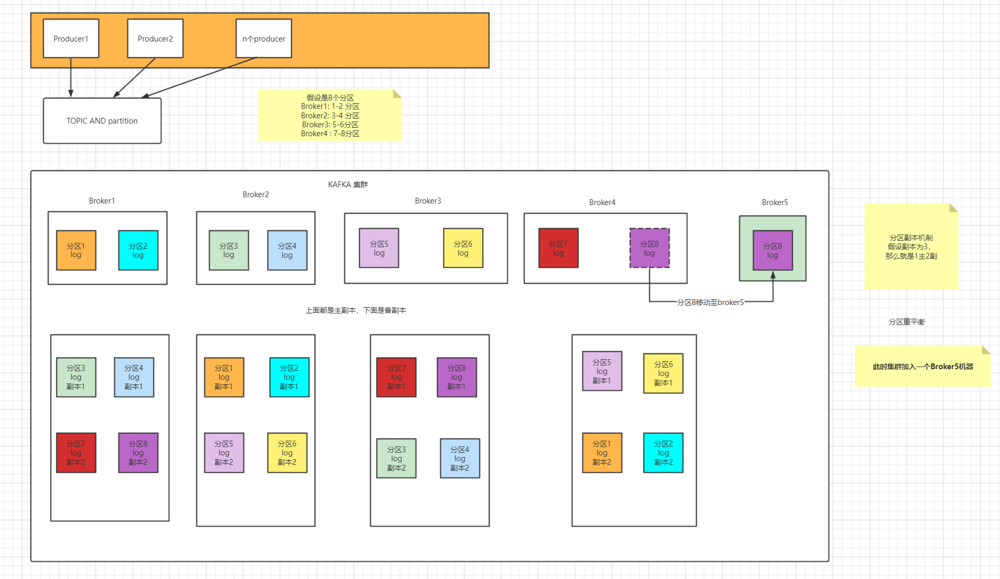
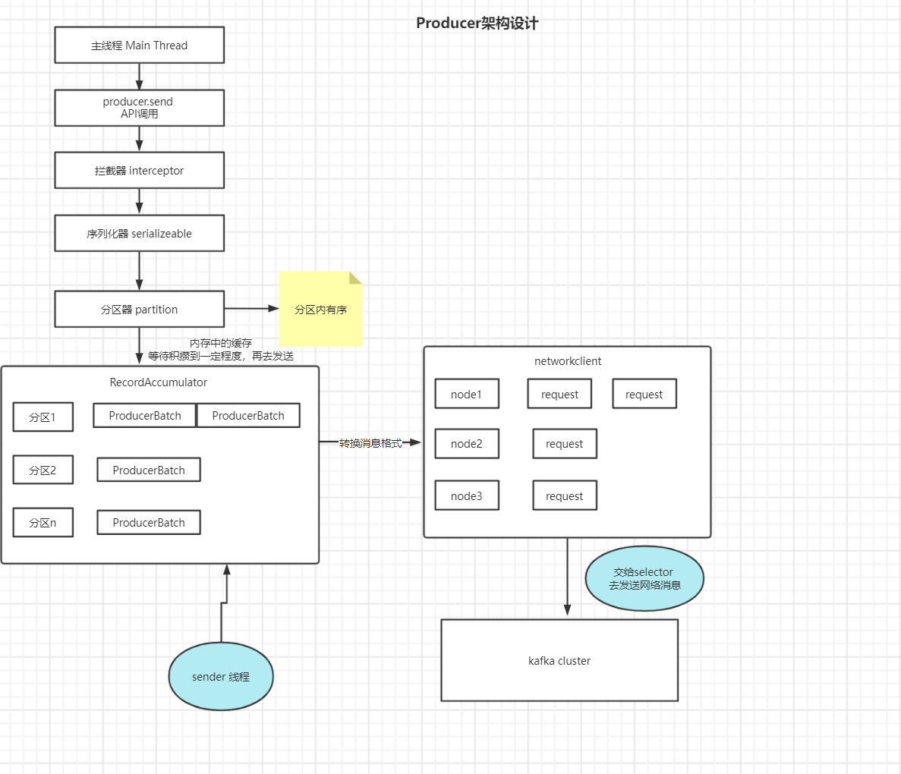
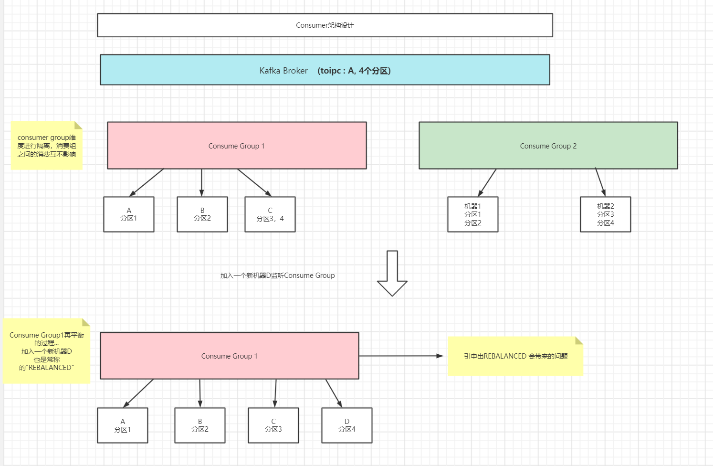
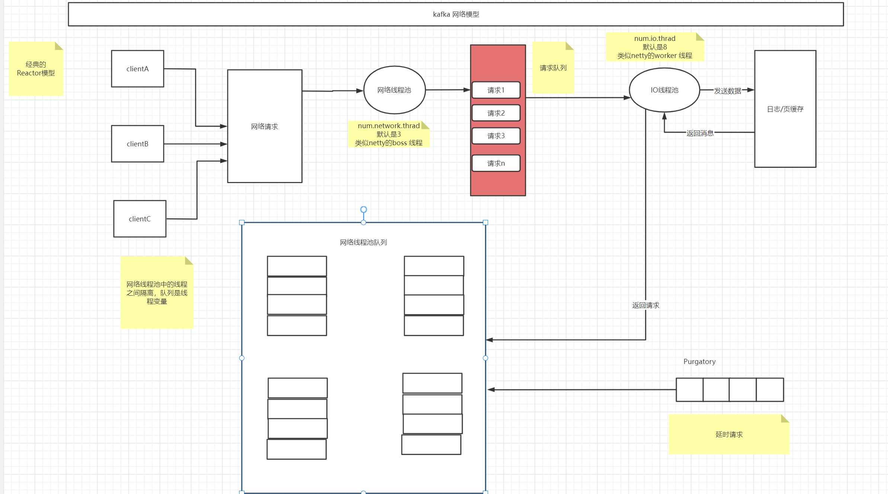

### kafka基础知识：  
- producer,broker,consumer，协调者（zookeeper，2.7版本后已经移除）  
整体架构如下：
  

- kafka的主副本和分区机制  
分区数在创建主题的时候已经确定，消息会进行打散，分布在不同的主题上  

主副本和分区机制
   


### 生产者   
kafka producer是从0.9.x版本开始后，使用Java语言来编写客户端，<B>是线程安全的</b>

- hello world:  
```java
public class TigerKafkaSender {

    private Producer<String, String> producer;

    public TigerKafkaSender() {
        Properties properties = new Properties();

        properties.setProperty("bootstrap.servers", "127.0.0.1:9092");

        producer = new KafkaProducer<>(properties);
    }

    public void send() throws ExecutionException, InterruptedException {
        String key = "userId";
        ProducerRecord<String, String> producerRecord = new ProducerRecord<>("demo-topic", key,
                UUID.randomUUID().toString().replace("-", ""));
        Future<RecordMetadata> result = producer.send(producerRecord);
        // 阻塞主线程
        RecordMetadata recordMetadata = result.get();
        
        // 非阻塞
        producer.send(producerRecord);

    }

}
```   

- 组件：  
  - partition（分区器）  
  根据key来决定该消息要发到哪个分区中，如果key为空，是轮训发送
  - Interceptor （拦截器）   
  0.10.0.0版本后引入，拦截生产者的消息内容，注意不要在拦截器做太重的逻辑，因为这部分逻辑都是在主线程上进行。  
  - Serialize（序列化器）  
默认的StringSerialize和StringDerialize方式


- producer的架构如下：    
  


- 核心参数：  
```text
 acks: ack=1,向leader写入即可，ack=0, 发送成功即可，ack=-1,向所有副本都要写入消息
 max.request.size：客户端发送消息体的最大大小
retries和retry.backoff.ms：前者表示发送失败，重试的次数，后者表示retry的间隔
linger.ms: 发送者发送之前，等待的时间，其实就是等待更多的ProducerBatch消息过来，目的是提高吞吐
request.timeout.ms: 生产者发送的超时时间
```    


### consumer 消费者  
特点：线程不安全，只允许一个线程去执行consumer的代码；   
```java
/**
     * Acquire the light lock protecting this consumer from multi-threaded access. Instead of blocking
     * when the lock is not available, however, we just throw an exception (since multi-threaded usage is not
     * supported).
     * @throws ConcurrentModificationException if another thread already has the lock
     */
    private void acquire() {
        long threadId = Thread.currentThread().getId();
        if (threadId != currentThread.get() && !currentThread.compareAndSet(NO_CURRENT_THREAD, threadId))
            throw new ConcurrentModificationException("KafkaConsumer is not safe for multi-threaded access");
        refcount.incrementAndGet();
    }
```  

- 基础概念： 
  - 消费组和消费者 （消费组之间是互不影响的） 
    
  - 消费分区内的数据，并且分区内是能够做到消费有序的  
  - 消费者的ACK参数可设置，自动提交OR手动提交  
  
- hello world  
  ```java
  ```   
- 消费位移  
  当前消费者消费到的位置，叫 'offset', 这部分信息存储在kafka内部的主题，<B>_consumer_offsets</B>中，  
  消息结构体的设计：

```java
KEY: CONSUMER_GROUP（消费组）, TOPIC（主题名）,PARTITION（分区号）
VALUE: 位移的数量
```

Kafka会定期去删除位移主题的过期消息，使用一个后台线程去将过期的数据进行删除
- 重平衡（rebalanced）  
  定义：让一个Consumer Group中的Consumer实例，共同协调和达成分区重新消费分区的过程。    

重平衡会导致ConsumeGroup中的Consumer的消费停止，直到分区平衡之后，消费者再开始重新消费。 

导致重平衡的原因： <B>消费组中成员数量发生变化 </B>  
1、消费者进行重启  
2、 Coordionator协调者，也就是Broker，长时间没有收到消费者的心跳，会进行下线（系统负载比较高，无法向Coordionator发送消息，也会造成协调者的下线）  
相关心跳的参数：  
```text
配置心跳检查参数：
 session.timeout.ms（如果这一批都失败，会触发Rebalanced）
 heartbeat.interval.ms （心跳间隔的时间，每隔XS会发送请求）
```  
3、Consumer距离上次拉取消息的距离过长，比如Consumer要处理的业务逻辑太重，耗时非常长，Coordionator会认为Consumer已经下线，会触发重平衡  
```text
max.poll.interval.ms (消费拉取两次消息的最大时长)
```  

可以看到，重平衡的过程中，是无法去对消息进行消费的，必须等协调者重新分配好消费者对应的消费分区，消费者才能重新消费，大大影响了消费者的吞吐量，所以要尽量避免重平衡。  
- kafka consumer提交消费位移:  
自动提交：consumer每隔一段时间会自动提交消费的位移   
<B>带来的问题</B>：  
  1、项目重启后，会导致消息没有正常处理消费，消费会发生丢失   
  2、Rebalance重平衡，会导致消息重复消费   

手动提交：  
```java
 /**
     * 手动提交消费位移
     */
    public void consumerSyncManuallyCommit() {
      while (true) {
          ConsumerRecords<String, String> records = consumer.poll(Duration.ofMillis(1000));
          // 处理消息
          process(records);

          // 手动提交消息
          try {
              // 同步提交
              consumer.commitSync();
          } catch (CommitFailedException e) {
                // todo 处理手动提交异常的场景
              handleError(e);
          }

      }

    }
```   
commitAsync(): 异步提交，只能拿到提交的结果：  
```java
private void consumerAsyncManually() {
        while (true) {

            ConsumerRecords<String, String> records = consumer.poll(Duration.ofMillis(1000));
            // 处理消息
            process(records);

            try {
                consumer.commitAsync(new OffsetCommitCallback() {
                    @Override
                    public void onComplete(Map<TopicPartition, OffsetAndMetadata> offsets,
                            Exception exception) {
											// do the async results
                    }
                });
            } catch (CommitFailedException e) {

            }
        }

    }
```   
手动提交offset   
```java
/**
     * 批量提交位移
     */
    private void consumerBatchManually() {
         Map<TopicPartition, OffsetAndMetadata> offsets = new HashMap<>();
         int count = 0;
        while (true) {

            ConsumerRecords<String, String> records = consumer.poll(Duration.ofMillis(1000));
            // 处理消息
            for (ConsumerRecord<String, String> record : records) {
                process(record);

                // key is topic-partition
                // value is the offset 
                offsets.put(new TopicPartition(record.topic(), record.partition()), new OffsetAndMetadata(record.offset() + 1));
                count++;
                
                // per 100, do commit
                if (count % 100 == 0) {
                    // commit batch, but no callback
                    consumer.commitAsync(offsets, null);
                }
            }
            
            // commit
            
        }
    }
```  

kafka使用**commit.commitSync**可能会导致抛出**CommitFailedException**的异常   
```text
原因是消费者组已经开启了 Rebalance
过程，并且将要提交位移的分区分配给了另一个消费者实例。出现这个情况的原因是，你的
消费者实例连续两次调用 poll 方法的时间间隔超过了期望的 max.poll.interval.ms 参数
值。这通常表明，你的消费者实例花费了太长的时间进行消息处理，耽误了调用 poll 方
法。
```

解决的方案：

1. 增加期望的时间间隔 [max.poll.interval.ms](http://max.poll.interval.ms/) 参数值。
2. 减少 poll 方法一次性返回的消息数量，即减少 max.poll.records 参数值。

如何实现：

1、缩短单条消息的处理时间

2、增加 Consumer 端允许下游系统消费一批消息的最大时长

3、减少下游系统一次性消费的消息总数

4、 下游系统使用多线程来加速消费   

重平衡的回调函数：   
```java
void onPartitionsRevoked(Collection＜TopicPartition＞partitions)
 这个方法会在再均衡开始之前和消费者停止读取消息之后被调用。可以通过这个回调方法来处理消费位移的提交，以此来避免一些不必要的重复消费现象的发生。参数partitions表示再均衡前所分配到的分区
```    

```java   
void onPartitionsAssigned(Collection＜TopicPartition＞partitions)
这个方法会在重新分配分区之后和消费者开始读取消费之前被调用。参数partitions表示再均衡后所分配到的分区
```

### kafka的副本机制
1、副本不提供读写能力，只负责从leader中同步数据

2、ISR(与Leader同步的副本)— PS：选举的副本只会从ISR副本中进行选举

如果ISR副本从只有主副本，主副本挂掉后，将不会选出新的副本，导致副本不可用，会有所丢失…

如何判断？该副本是否是ISR副本呢？

ps: 参考是 Broker 端参数 [**replica.lag.time.max.ms](http://replica.lag.time.max.ms/) （follower副本落后主副本的最长时间，默认是10s）**

非ISR副本的其他副本，默认是不能给zookeeper协调者进行选举的。除非开启Broker参数：**unclean.leader.election.enable（默认是false，开启后就是true了）**

其实也是一个KAFKA的CAP能力，是选择A（可用性）还是选择C（一致性），由用户本身来决定。    

### kafka的网络模型   
   

### 消费组重平衡的过程   
.jpg) 
 

